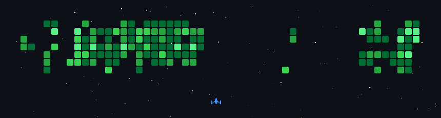

  

> *"It’s a pleasure to be found by you!"* 👋

### About Me
- **Education**: Is a student At **Vocational High School Brantas Karangkates**
- **Working On**:
  - Exploring various programming languages
  - Exploring various stacks
- **Funfact**: Likes staying active offline 📖

### 🎯 Goal(s)

- ~_Lives happily_ [✔️]~
- **Building my own portofolio web project [ ]**

---

### 🛠️ Skills

| I have | I'm learning | In the memory banks |
| :---: | :---: | :---: |
|             |          |           |

---

### 💻 Tools I Use

  
  
  
  
  

---

### 🖥️ Operating Systems I Use

  
  
  

---

### 📊 GitHub Stats

  <picture>
    <source media="(prefers-color-scheme: dark)" srcset="https://github-readme-streak-stats.herokuapp.com/?user=fachturrpl1&theme=dark&hide_border=true&background=00000000&ring=B845ED&fire=B845ED&currStreakNum=B845ED&currStreakLabel=B845ED&sideNums=FFFFFF&statNames=B845ED&dates=999999" />
    <source media="(prefers-color-scheme: light)" srcset="https://github-readme-streak-stats.herokuapp.com/?user=fachturrpl1&theme=default&hide_border=true&background=00000000&ring=6B2FA0&fire=6B2FA0&currStreakNum=6B2FA0&currStreakLabel=6B2FA0&sideNums=333333&statNames=6B2FA0&dates=666666" />
    
  </picture>

---

### 👾 Incase You're Bored

---

### In my freetime

  
  
  

### Connect with Me

  
  
  

